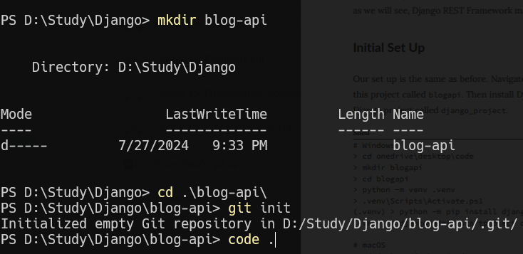

## Crear un Entorno virtual

```
$ py -m venv .venv
$ .venv\Scripts\Activate.ps1
$ python-m pip install django
$ django-admin startproject django_project .
```

## Añadir el .gitignore

.venv/

python manage.py startapp accounts