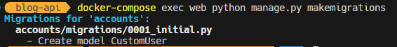
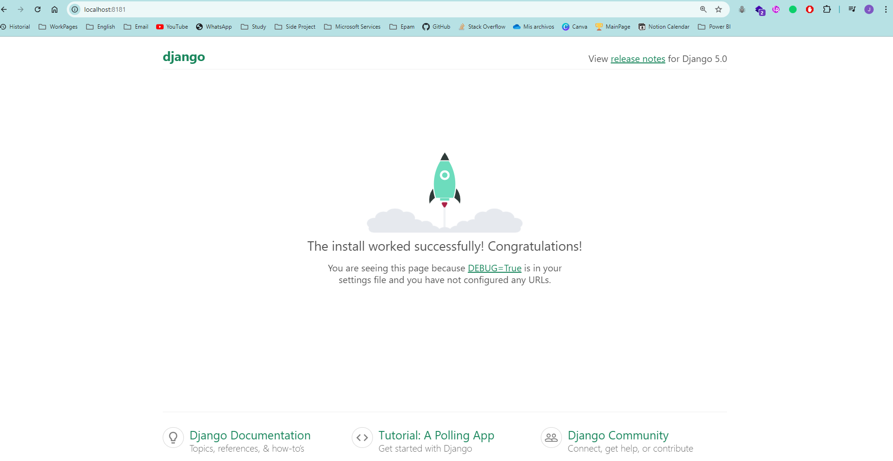
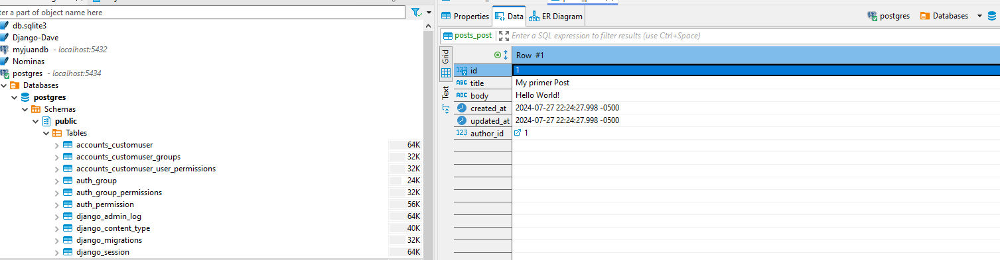
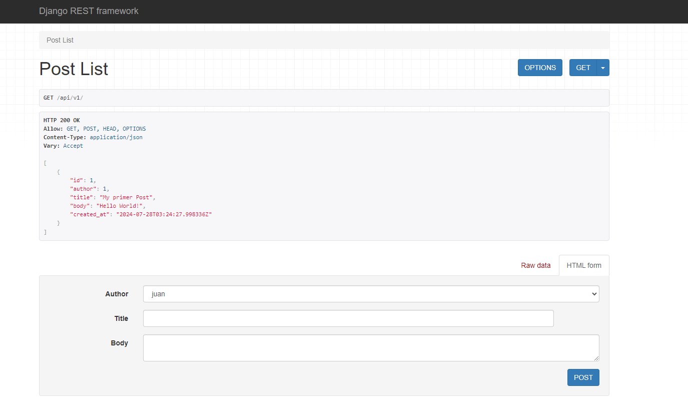

# API Blog 

Trabajo hecho por **Juan José Figueroa Navarro**

Recreación del capitulo 6 de **DJANGO for APIs by William S. Vincent**

## Configuración Inicial

1. Crear una carpeta donde va a ser alojado el proyecto y inicializar git

    

2. Crear un Entorno virtual, activarlo e instalar django

    ```
    $ py -m venv .venv
    $ .venv\Scripts\Activate.ps1
    $ python-m pip install django
    $ django-admin startproject django_project .
    ```
3. Añadir el .gitignore

    ```py
    # .gitignore
    .venv/
    ```
4. Crear la aplicacion de accounts

    ```
    $ python manage.py startapp accounts
    ```

## Añadiendo PostgresSQL

### Instalando Bibliotecas
1. Intalamos pyscopg2-binary para poder usar postgres SQL y ademas lo ponemos en el archivo requirements.txt para a la hora de hacer nuestro contenedor este instale lo requerido para funcionar

    ```
    $ pip install pyscopg2-binary
    $ pip freeze > requirements.txt
    ```
    Este es nuestro archivo requirements.txt
    ```py
    # requirements.txt
    asgiref==3.8.1
    Django==5.0.7
    psycopg2-binary==2.9.9
    sqlparse==0.5.1
    tzdata==2024.1
    ```
2. Añadimos nuestra conexion de base de datos al archivo 
    ```py
    #django_project/settings.py
    DATABASES = {
        "default": {
            "ENGINE": "django.db.backends.postgresql",
            "NAME": "postgres",
            "USER": "postgres",
            "PASSWORD": "postgres",
            "HOST": "db",
            "PORT": 5432,
        }
    }
    ```

## Instalacion de Docker
1. Creamos el Dockerfile y .dockerignore el cual va a construir una imagen con nuestro proyecto que va a contener lo necesario para que se ejecute nuestra aplicación.

    
    

2. Creamos el archivo docker compose donde vamos a especificar que servicios vamos a crear en este caso la **web** que sera nnuestro proyecto de Django y **db** la base de datos en Postgres.

    Podemos ver que abrimos el puerto 8181 de nuestra maquina local pero internamente se va a trabajar en el puerto 8000

    

2. Usamos <code>$ deactivate</code> para desactivar nuestro entorno virtual
3. Verificamos la existencia de imagenes y que no se este usando los puertos 

    <code>$ docker ps </code> <br>
    <code>$ docker ps -a</code>

4. Construir la imagen    
    <code>$ docker-compose up -d --build</code>      
    Podemos ver como se construye la iamgen y queda inicializado :

    

    Comprobamos que este funcionando en nuestro Docker Desktop
    
    

## Migracion de la base de datos en el contenedor

1. Primero generamos las migraciones por el modelo CustomUser
    
    <code>$ docker-compose exec web python manage.py makemigrations</code>
    
    

2. Migramos los modelos a la base de datos
    
    <code>$ docker-compose exec web python manage.py migrate</code>
    
    

3. Creamos un super usuario para poder ingresar al sitio de administrador en nuestra aplicacion

    <code>docker-compose exec web python manage.py createsuperuser</code>
    
    

## Verificación dentro del contenedor

1. Verificamos que nuestra aplicación este funcionando correctamente

    Como podemos ver en la siguiente imagen esta funcionando en nuestro puerto 8181 tal y como lo habiamos configurado
    

2. Verificamos nuestra base de datos con ayuda de nuestro programa **DBeaver**

     

    Podemos ver que la conexión es exitosa
3. Verificar nuestro registro 
    
    Podemos ver que esta nuestro super usuario en la base de datos
    

## Formularios

1. Creamos un formulario customizado para que en el sitio de administracion sea diferente el cual 

    

## Crear la aplicación de Posts

1. <code>$ docker-compose exec web python manage.py startap posts</code>
    
    

2. <code>$docker-compose exec web python manage.py makemigrations posts </code>

    

3. <code>$docker-compose exec web python manage.py migrate</code>

    
    
4. Creamos nuestro primer posts
    

## Test




## Instalacion de Django REST Framework

1. Desactivamos el container
    
2. Activamos nuestro entorno virtual
    <code>$ .venv\Scripts\Activate.ps1 </code>
3. Instalamos 
    <code>$ pip install djangorestframework </code>
4. Actualizamos nuestros requerimientos
    <code>$ pip freeze > requirements.txt</code>
    ```py
    #requirements.txt
    asgiref==3.8.1
    Django==5.0.7
    djangorestframework==3.15.2
    psycopg2-binary==2.9.9
    sqlparse==0.5.1
    tzdata==2024.1
    ```

## Instertamos el Path de nuestra API


1. Construir la imagen con los nuevos cambios
    <code>$ docker-compose up -d --build</code>
    

2. Comprobar si funciona 
    
    Efectivamente esta nuestro primer registro
3. Los detalles de solo el registro

4. Crear un registro desde la api con el Put


5. Verificación en la base de Datos

    
    

## Instalacion de CORS

1. <code>$ docker-compose down</code>
2. <code>$ pip install django-cors-headers</code>
3. <code>$ pip freeze > requirements.txt</code>
    ```py
    #requirements.txt
    asgiref==3.8.1
    Django==5.0.7
    django-cors-headers==4.4.0
    djangorestframework==3.15.2
    psycopg2-binary==2.9.9
    sqlparse==0.5.1
    tzdata==2024.1
    ```